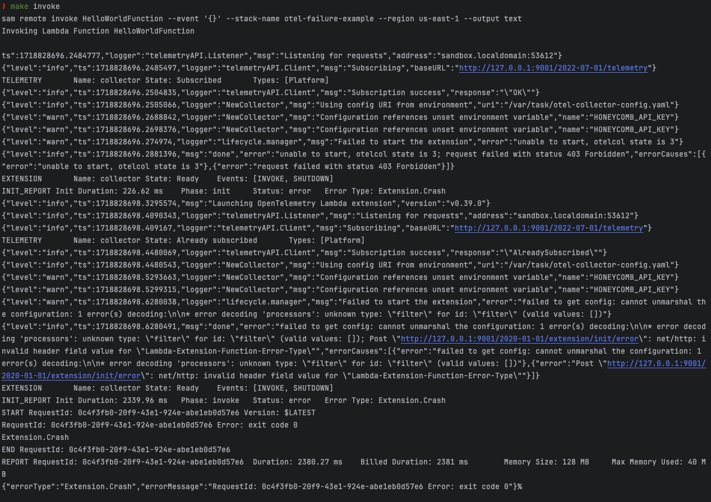

# Otel Failure example in AWS Lambda

Example repository that demonstrates that you can't set the Otel collector config with filterprocessor because the AWS OTel layer uses v0.39.0 of the OTel collector, which was last released 3 years ago. https://github.com/open-telemetry/opentelemetry-collector-releases/releases/tag/v0.39.0

I would like to be able to specify this in my Otel collector config:

```yaml
processors:
  filter:
    error_mode: ignore
    traces:
      span:
        - 'exists(attributes["error"]) == true and IsMatch(name, ".*DynamoDB.*") == true'
        - 'exists(attributes["error"]) == true and IsMatch(name, ".*STS.*") == true'
        - 'exists(attributes["error"]) == true and IsMatch(name, ".*S3.*") == true'
      spanevent:
        - 'exists(attributes["error"]) == true and IsMatch(name, ".*DynamoDB.*") == true'
        - 'exists(attributes["error"]) == true and IsMatch(name, ".*STS.*") == true'
        - 'exists(attributes["error"]) == true and IsMatch(name, ".*S3.*") == true'
```

But according to Honeycomb, this is only available if you are using v0.66.0 of the collector package, as noted in the Honeycomb docs [here](https://docs.honeycomb.io/send-data/opentelemetry/collector/#filtering-span-events-and-other-data).

# Demo Prerequisites

- [AWS CLI](https://docs.aws.amazon.com/cli/latest/userguide/cli-configure-quickstart.html)
- [AWS SAM CLI](https://docs.aws.amazon.com/serverless-application-model/latest/developerguide/serverless-sam-cli-install.html)

# Steps to Reproduce

1. Clone this repository

```bash
git clone https://github.com/kmcquade/otel-failure-example.git
cd otel-failure-example
```

2. Run `make deploy` to deploy the AWS Lambda function. It will create a new stack with the name `otel-failure-example`.

```bash
make deploy
```

3. Run `make invoke` to invoke the AWS Lambda function.

```bash
make invoke
```

4. Observe the output. 

You will notice that when the Lambda tries to load, it tries to load the specified Otel Collector config yaml file. It fails on processing the file because the `filterprocessor` is not available in the v0.39.0 version of the collector. Per this [Honeycomb doc](https://docs.honeycomb.io/send-data/opentelemetry/collector/#filtering-span-events-and-other-data), the `filterprocessor` is only available in v0.66.0 or higher of the collector.

See the following error message in the Cloudwatch logs (formatted for clarity):

```
{
    "level":"warn",
    "ts":1718828698.6280038,
    "logger":"lifecycle.manager",
    "msg":"Failed to start the extension","error":"failed to get config: cannot unmarshal the configuration: 1 error(s) decoding:\n\n* error decoding 'processors': unknown type: \"filter\" for id: \"filter\" (valid values: [])"
}
```

5. Clean up by deleting the Cloudformation stack.

```bash
make delete
```

# Example output

